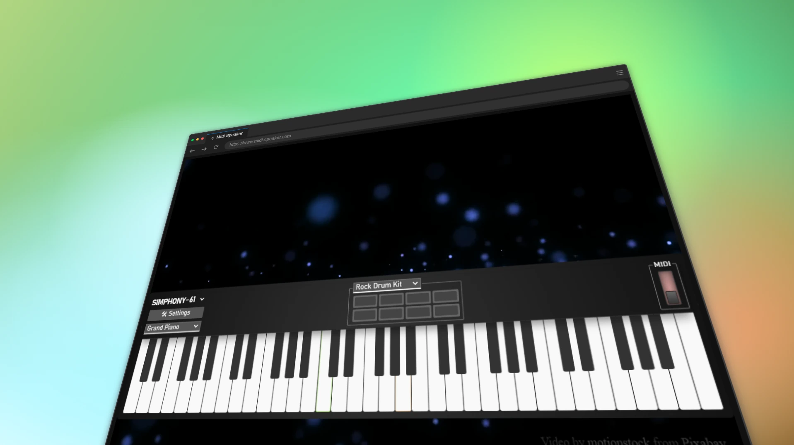
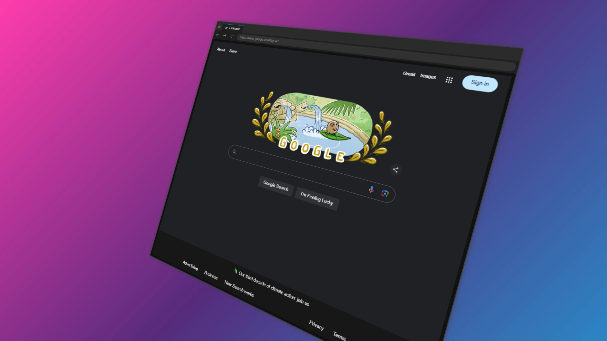
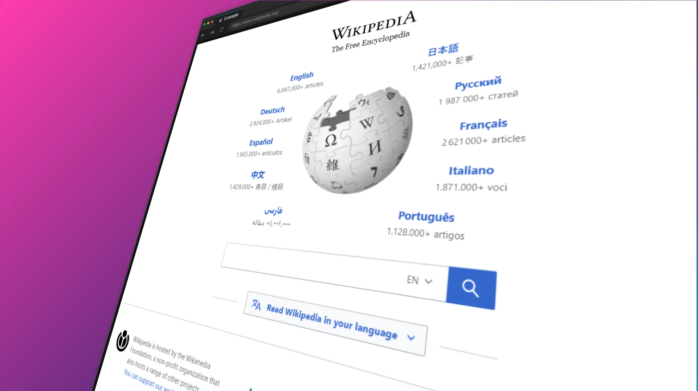
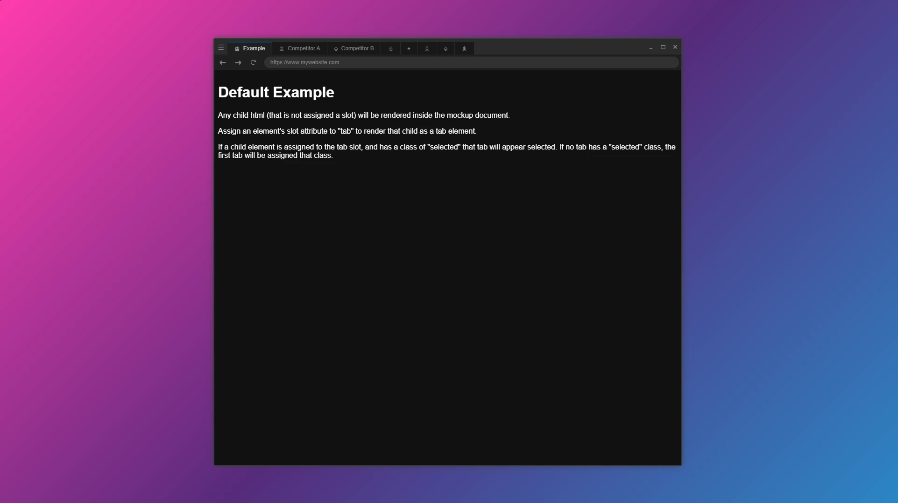

# `<browser-mockup>`
A custom `HTMLElement` that mocks the appearance of browser "chrome" for screenshots and demonstrations.



## Quick Reference
```html
<browser-mockup url="https://www.mysite.com" tabs="2" collapsed-tabs="3"></browser-mockup>
<browser-mockup>
    <span slot="tab" class="selected">
        <span class="icon">&check;</span>
        <span class="label">Fully Custom Tab</span>
    </span>
    <span slot="tab" data-icon="Ω"></span>
    <span slot="tab" data-label="Omega"></span>
    <span slot="tab" data-icon="α" data-label="Alpha"></span>
</browser-mockup>
<script type="module" src="/path/to/browser-mockup[.min].js"></script>
```

## Demo
https://catapart.github.io/magnitce-browser-mockup/demo/

### Screenshot Utility
Load a webpage, or raw html/css into a browser mockup in the screenshot demo:  
https://catapart.github.io/magnitce-browser-mockup/demo/screenshot.html

The Screenshot Utility can be used to pose a mockup in 3D space, and provides controls for common features like the main tab's label, and the action button variations.




This utility is unrelated to functionality of the actual `<browser-mockup>` element. It is intended for generating images in the limited circumstances where the images it renders are of acceptable quality for their intended uses.

## Support
- Firefox
- Chrome
- Edge
- <s>Safari</s> (Has not been tested; should be supported, based on custom element support)

### Reference/Install
#### HTML Import
```html
<script type="module" src="/path/to/browser-mockup[.min].js"></script>
```
#### npm
```cmd
npm install @magnit-ce/browser-mockup
```

### Import
#### Vanilla js/ts
```js
import "/path/to/browser-mockup[.min].js"; // if you didn't reference from a <script>, reference with an import like this

import { PathRouter } from "/path/to/browser-mockup[.min].js";
```
#### npm
```js
import "@magnit-ce/browser-mockup"; // if you didn't reference from a <script>, reference with an import like this

import { PathRouter } from "@magnit-ce/browser-mockup";
```

## Usage
### Attributes
The following attributes can be used to set the appearance and tab content of the `browser-mockup` element:
- `url`: sets the text of the element's address bar content
- `tabs`: adds a number of random tabs into the tab bar after all of the defined tabs
- `collapsed-tabs`: adds a number or collapsed tabs into the tab bar after all of the defined collapsed tabs

### Contents
Any content inside the `browser-mockup` element (that is not assigned to a tab slot) will be rendered inside the element as if it were in a document's "body" tag. All of these elements remain entirely style-able and accessible to scripting (no iframes). 

### Tabs
To create custom tabs, set the `slot` attribute of any child element in the `browser-mockup` element to "tab".
```html
<browser-mockup>
    <span slot="tab"></span>
    <div slot="tab"></div>
</browser-mockup>
```
To customize the tab, you can use either the `data-label` and `data-icon` attributes, or you can set the label and icon content explicitly, using child elements.

#### Tab Attributes
##### Tab with random icon and custom text label
```html
<browser-mockup>
    <span slot="tab" data-label="Cash Money"></span>
</browser-mockup>
```
##### Tab with custom text icon and custom label
```html
<browser-mockup>
    <span slot="tab" data-icon="$" data-label="Cash Money"></span>
</browser-mockup>
```
##### Collapsed Tab with custom text icon
```html
<browser-mockup>
    <span slot="tab" data-icon="$"></span>
</browser-mockup>
```
##### Collapsed Tab with random icon
```html
<browser-mockup>
    <span slot="tab"></span>
</browser-mockup>
```

#### Child Elements
##### Tab with custom label
```html
<browser-mockup>
    <span slot="tab">
        <span class="label">Fire<sup>2</sup></span>
    </span>
</browser-mockup>
```
##### Tab with custom icon and custom label
```html
<browser-mockup>
    <span slot="tab">
        <span class="icon"></span>
        <span class="label">Fire<sup>2</sup></span>
    </span>
</browser-mockup>
```
##### Collapsed Tab with custom icon
```html
<browser-mockup>
    <span slot="tab">
        <span class="icon"></span>
    </span>
</browser-mockup>
```

## Styling
### Content Styling
All content elements should retain all of their styles, as no elements are injected into the `shadowDOM` and no `iframe` elements are used to render content.  
If you are seeing issues in the way your styled content is rendering, a common issue is that styled content may target a document's `body` tag, which would need to be retargeted, in the mockup, to the element's `body` part (`body { color: #fff }` becomes `browser-mockup::part(body) { color #fff }`).

### Mockup Styles
The `<browser-mockup>` element uses the `shadowDOM` to obfuscate the decorative elements from the content elements. For convenience, all elements rendered in the `shadowDOM` have been given `part` attribute values, so that they can be accessed using the CSS `::part()` selector.

For the most common use-cases, css properties (variables) are used which can be overridden on the `<browser-mockup>` element.  
See the property names, and their default values, below :
```css
browser-mockup
{
    --border-radius: 5px;
    --margin: 1em;
    --shadow-color: rgb(0 0 0);
    --box-shadow: 0 0 15px -3px var(--shadow-color);

    --background: canvas;
    --border-color: canvastext;
    --header-background: #2b2b2b;
    --header-font-color: #868686;
    --url-color: #313131;
    --tab-background: #181818;
    --tab-selected-background: #1f1f1f;
    --tab-highlight: #0078d4;
    --tab-selected-font-color: #d7d7d7;
}
```

For styling parts, here are the css selectors for each part:
```css
browser-mockup::part(header) { }
browser-mockup::part(tabs) { }
browser-mockup::part(actions) { }
browser-mockup::part(action-minimize) { }
browser-mockup::part(action-maximize) { }
browser-mockup::part(action-close) { }
browser-mockup::part(navigation) { }
browser-mockup::part(history) { }
browser-mockup::part(button-back) { }
browser-mockup::part(button-forward) { }
browser-mockup::part(button-refresh) { }
browser-mockup::part(url) { }
browser-mockup::part(path) { }
browser-mockup::part(body) { }
```

## License
This library is in the public domain. You do not need permission, nor do you need to provide attribution, in order to use, modify, reproduce, publish, or sell it or any works using it or derived from it.
